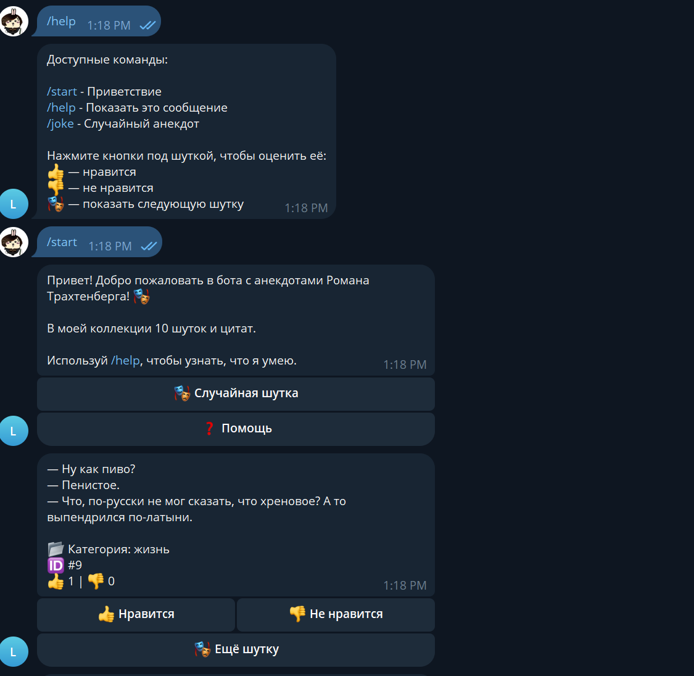

# 🎭 Roman Trakhtenberg Jokes Bot

Telegram bot that delivers jokes and quotes from Roman Trakhtenberg's comedy repertoire. Users receive random jokes and can rate them with 👍/ buttons.



---

## Product Context

### End User
- Admirers of humor and wit
- Russian-speaking Telegram users
- Fans of stand-up comedy and clever observations about life

### Problem It Solves
Provides instant access to a curated collection of Roman Trakhtenberg's jokes and quotes — no need to search through books or social media, just ask the bot for a joke.

### Our Solution
A simple, elegant Telegram bot that:
- Delivers random jokes on command
- Categorizes jokes by themes (life, relationships, work, philosophy, etc.)
- Allows users to rate jokes with inline buttons
- Runs as a client that communicates with a FastAPI backend

---

## Architecture

```
┌──────────────┐     HTTP      ┌──────────────┐     PostgreSQL    ┌──────────┐
│  Telegram    │ ◄──────────►  │  Backend     │ ◄──────────────►  │  VM DB   │
│   Bot        │  API calls   │  FastAPI     │      queries      │ (5433)   │
│  (aiogram)   │               │  (port 42020) │                   │          │
└──────────────┘               └──────────────┘                   └──────────┘
```

### Components

| Component | Tech | Location |
|-----------|------|----------|
| **Client** (Telegram bot) | Python, aiogram | Runs locally / Docker |
| **Backend API** | Python, FastAPI, SQLAlchemy | Docker on VM |
| **Database** | PostgreSQL | Docker on VM |

### Backend API Endpoints

| Method | Endpoint | Description |
|--------|----------|-------------|
| `GET` | `/api/jokes/random` | Get a random joke |
| `GET` | `/api/jokes/{id}` | Get a joke by ID |
| `GET` | `/api/jokes/categories` | Get all categories |
| `GET` | `/api/jokes/category/{name}` | Get a random joke from category |
| `GET` | `/api/jokes/top` | Get top-rated jokes |
| `POST` | `/api/jokes/{id}/rate` | Rate a joke (1 or -1) |
| `GET` | `/api/stats` | Get statistics |
| `POST` | `/api/jokes` | Add a new joke |

---

## Features

### Version 1 (Core)
- ✅ `/start` — Welcome message
- ✅ `/help` — List available commands
- ✅ `/joke` — Get a random joke with rating buttons
- ✅ Inline keyboard: 👍 / 👎 / Next joke
- ✅ FastAPI backend with PostgreSQL
- ✅ Docker containerization
- ✅ Deployed on VM

### Version 2 (Enhanced)
- ✅ Rating system persisted via PostgreSQL
- ✅ One-click "Next joke" for quick browsing
- ✅ Joke categories in backend API
- ✅ API endpoint for adding new jokes

---

## Project Structure

```
se-toolkit-hackathon/
├── .env.bot.secret           # Bot token + API URL (gitignored)
├── .env.example              # Template for env vars
├── .gitignore
├── docker-compose.yml        # Orchestrates backend + bot + postgres
├── LICENSE
├── PLAN.md                   # Development plan
├── README.md                 # This file
├── backend/                  # FastAPI REST API
│   ├── app/
│   │   ├── main.py           # FastAPI app + routes
│   │   ├── models.py          # SQLAlchemy models
│   │   ├── database.py        # DB connection
│   │   ├── crud.py            # Database CRUD
│   │   ├── schemas.py         # Pydantic schemas
│   │   └── seed.py            # Initial joke seeder
│   ├── Dockerfile
│   ├── entrypoint.sh          # Seed DB + start server
│   └── pyproject.toml
└── bot/                      # Telegram bot (aiogram)
    ├── bot.py                 # Entry point
    ├── config.py              # Settings
    ├── Dockerfile
    ├── pyproject.toml
    ├── handlers/
    │   └── commands.py        # Command handlers (pure functions)
    └── services/
        └── api.py             # HTTP client to backend API
```

---

## Usage

### Local Development

1. **Clone the repository**
   ```bash
   git clone https://github.com/boopEvdakov/se-toolkit-hackathon.git
   cd se-toolkit-hackathon
   ```

2. **Create environment file**
   ```bash
   cp .env.example .env.bot.secret
   ```
   Edit `.env.bot.secret`:
   ```
   BOT_TOKEN=your_telegram_bot_token_from_BotFather
   API_BASE_URL=http://localhost:42020
   ```

3. **Run bot in test mode**
   ```bash
   cd bot
   uv run bot.py --test "/joke"
   uv run bot.py --test "/start"
   uv run bot.py --test "/help"
   ```

4. **Run the bot**
   ```bash
   cd bot
   uv run bot.py
   ```

### Available Bot Commands

| Command | Description |
|---------|-------------|
| `/start` | Welcome message with inline buttons |
| `/help` | Show available commands |
| `/joke` | Get a random joke with rating buttons |

### Inline Buttons

| Button | Action |
|--------|--------|
| 👍 Нравится | Like the joke |
| 👎 Не нравится | Dislike the joke |
| 🎭 Ещё шутку | Get another random joke |
| ❓ Помощь | Show help |

---

## Deployment

### VM Requirements

- **OS:** Ubuntu 24.04
- **Docker** and **Docker Compose** installed
- SSH access for deployment
- Firewall configured (only necessary ports open)

### Deployment Steps

1. **Connect to VM**
   ```bash
   ssh user@your-vm-ip
   ```

2. **Install Docker (if not installed)**
   ```bash
   sudo apt update
   sudo apt install -y docker.io docker-compose-plugin
   sudo usermod -aG docker $USER
   ```

3. **Clone the repository**
   ```bash
   git clone https://github.com/boopEvdakov/se-toolkit-hackathon.git
   cd se-toolkit-hackathon
   ```

4. **Configure environment**
   ```bash
   nano .env.bot.secret
   ```
   Content:
   ```
   BOT_TOKEN=your_bot_token_here
   API_BASE_URL=http://jokes-backend:8000
   ```

5. **Build and start**
   ```bash
   docker compose up -d --build
   ```

6. **Verify services**
   ```bash
   docker compose ps
   docker compose logs -f jokes-backend
   docker compose logs -f jokes-bot
   ```

7. **Stop services**
   ```bash
   docker compose down
   ```

### Docker Compose Services

| Service | Image | Ports | Description |
|---------|-------|-------|-------------|
| `postgres` | postgres:18.3-alpine | 5433:5432 | PostgreSQL database |
| `jokes-backend` | Custom build | 42020:8000 | FastAPI backend |
| `jokes-bot` | Custom build | — | Telegram bot |

---

## Adding New Jokes

### Via API

```bash
curl -X POST http://your-vm-ip:42020/api/jokes \
  -H "Content-Type: application/json" \
  -d '{"text": "Your joke text here", "category": "life"}'
```

### Via Code

Edit `backend/app/seed.py` and add jokes to `JOKES_DATA`:

```python
{
    "id": 11,
    "text": "Your joke text here",
    "category": "life",
},
```

Then rebuild the backend container.

---

## Tech Stack

| Layer | Technology |
|-------|-----------|
| **Language** | Python 3.12+ |
| **Telegram framework** | aiogram 3.20+ |
| **Backend framework** | FastAPI |
| **ORM** | SQLAlchemy |
| **Database** | PostgreSQL 18 |
| **HTTP client** | httpx |
| **Containerization** | Docker + Docker Compose |
| **Package manager** | uv |

---

## MIT License

This project is open-source. See the [LICENSE](LICENSE) file for details.
